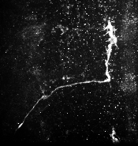
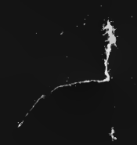

# Content-aware-Neuron-Image-Enhancement
Content-aware neuron image enhancement (CaNE) is an image enhancement algorithm for images with filamentous structures. 

## Introduction
By exploring the property of sparsity and tube-like structure in the neuron images, we formulate high quality neuron images with a cost function. By minimizing the cost function iteratively, clutters and noise in neuron images are gradually removed. For more details about this work, please refer to our publications [1,2]. 

1. [Content-aware Neuron Image Enhancement](http://people.virginia.edu/~hl2uc/resources/papers/neuron_enhancement_v3.pdf), Haoyi Liang, Scott Acton and Daniel Weller, IEEE International Conf. on Image Processing, pp. 3510-3514, 2017	
2. [Content-Aware Enhancement of Images with Filamentous Structures](https://ieeexplore.ieee.org/document/8633852), Haris Jeelani, Haoyi Liang, Scott Acton and Daniel Weller, IEEE Trans. on Image Processing, 2019 

*2D example*  
The left image is the input data, and the right one is the CaNE output.   
 

**3D example**  
This animation demonstrates how CaNE removes background clutters for 3D data.  

## Dependencies
1. `numpy`: matrix operation. Installation: `pip3 insall numpy`
2. `skimage`: Read and write image data. Installation: `pip3 install scikit-image`
